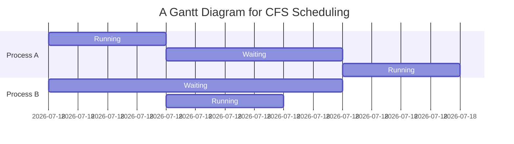

# xv6 CFS Scheduler with Red-Black Tree

## Overview

The xv6 operating system is a modern re-implementation of Sixth Edition Unix. This repository includes an implementation of the Completely Fair Scheduler (CFS) using a Red-Black Tree data structure to manage processes in a fair, efficient manner. The CFS aims to allocate CPU time among processes in such a way that each process gets a fair share of the CPU.

## Red-Black Tree Methods and Preemption Check

### Red-Black Tree Operations

- **Initialization (`rbTree_init`)**: Sets up the red-black tree with initial values, including latency and root pointers.
- **Insertion (`insert_process`)**: Adds a new process to the tree, placing it according to its virtual runtime.
- **Rotation Operations (`rotate_left`, `rotate_right`)**: Balance the tree by performing left and right rotations on nodes.
- **Retrieval Operations**: Include finding the next process to run (`retrieve_process`) and locating relatives like the grandparent or uncle of a node.
- **Deletion and Replacement Cases**: Handle the removal of a process from the tree and ensure the tree remains balanced after the operation.

### Preemption Check (`check_preemption`)

The `check_preemption` function evaluates whether the currently running process should be preempted. It considers if the process has exhausted its allotted timeslice or if there is a more suitable candidate (a process with a smaller virtual runtime) ready to run.

## Code Explanation

In `proc.h`, several fields were added to the `proc` structure to support CFS:

- **Process Tree Pointers**: `proc_left`, `proc_right`, and `proc_parent` for the Red-Black Tree structure.
- **Process Color**: `proc_color` indicating if the node is RED or BLACK.
- **CFS Attributes**: `virtual_runtime`, `current_runtime`, `proc_weight`, `nice`, and `max_exec_time` are used to calculate the process's share of CPU time.

## Formula Explanation for CFS Scheduling

In the Completely Fair Scheduler (CFS), the time slice or quantum for each process is determined using the formula:

$\text{timeslice}_k = \frac{\text{weight}_k}{\sum_{i=0}^{n-1}\text{weight}_i} \times \text{sched\_latency}$

Where:
- \( $\text{timeslice}_k$ \) is the time slice for process \( k \).
- \( $\text{weight}_k$ \) is the weight of process \( k \), which is inversely proportional to its nice value.
- \( $\text{sched\_latency}$ \) is the targeted scheduling period or latency over which every runnable task should run at least once.
- \( $\sum_{i=0}^{n-1}\text{weight}_i$ \) is the sum of weights of all runnable processes.

Virtual runtime is updated using the formula:

$\text{vruntime}_i = \text{vruntime}_i + \frac{\text{weight}_0}{\text{weight}_i} \times \text{runtime}_i$

Where:
- \( $\text{vruntime}_i$ \) is the virtual runtime of process \( i \).
- \( $\text{runtime}_i$ \) is the actual runtime of the process \( i \).

The scheduler selects the process with the smallest virtual runtime to run next.

## Test Programs and Visualization

Test programs are provided to demonstrate the effectiveness and fairness of the CFS scheduler. These can be visualized using Gantt charts, which are not included here but can be created using the Mermaid.js syntax as mentioned above.

This Gantt chart would illustrate that Process A runs for 2 seconds, then waits for 3 seconds while Process B runs for 2 seconds, after initially waiting for 5 seconds.

For a full visualization, these charts can be rendered in environments supporting Mermaid.js, allowing one to see the order of execution and time slices for each process in the system.
